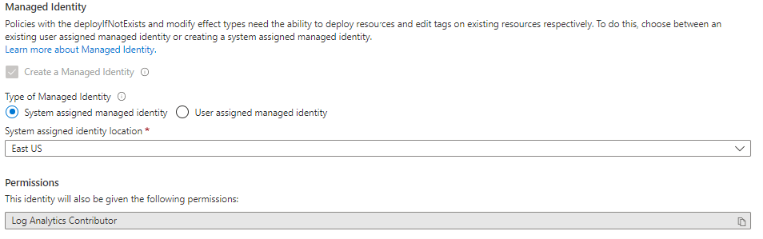
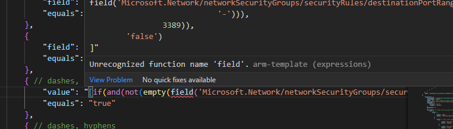
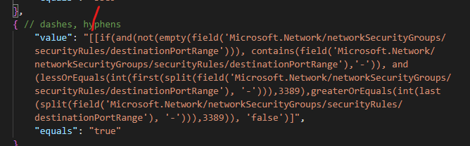
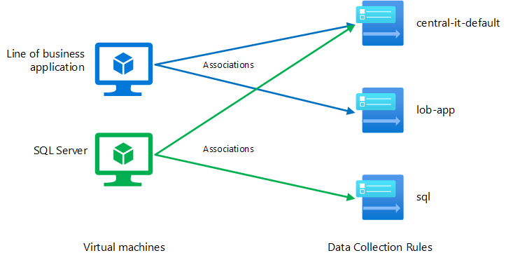
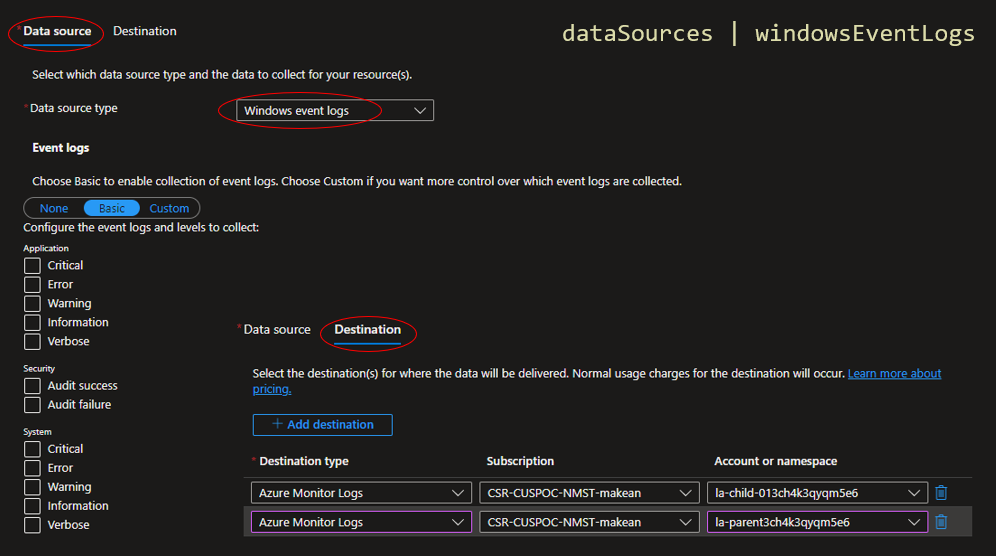
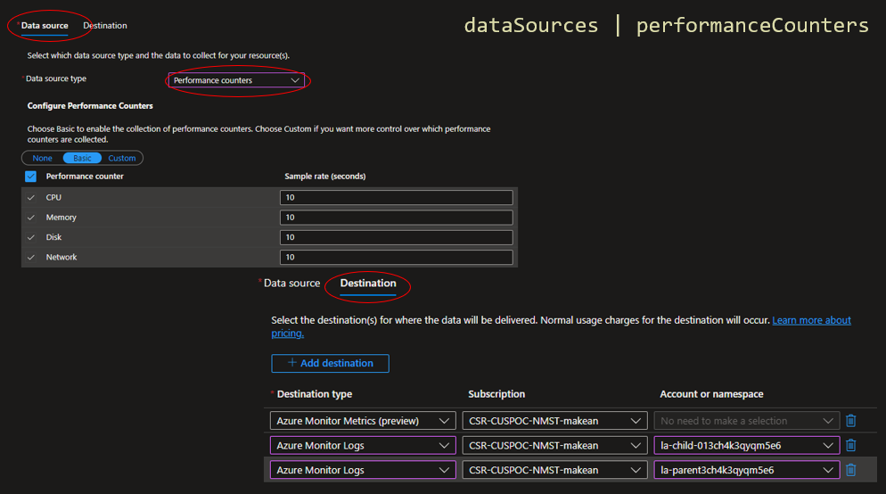
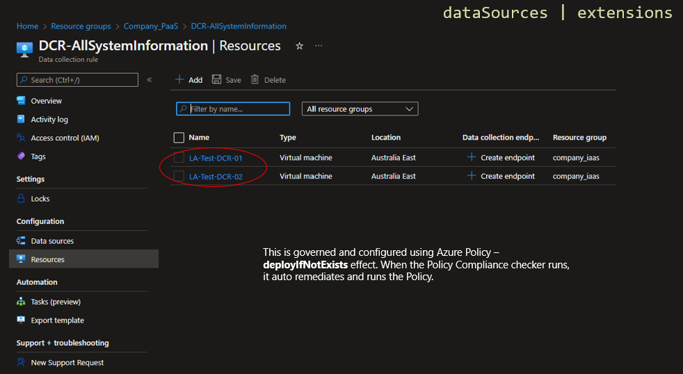
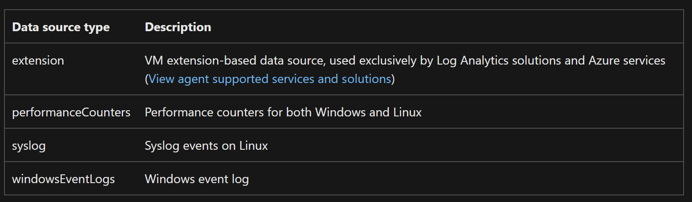
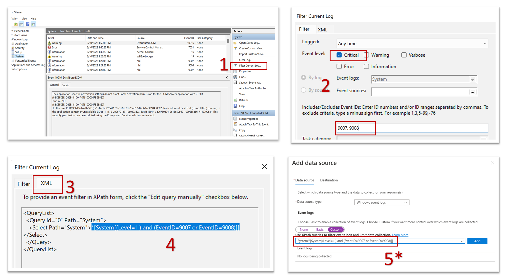

# Contents of this repo

- There's a Test environment folder which includes Bicep deployment files to deploy the test resources to Azure, so that you can test Azure Policy against real Azure Resources.
  - You will need to install the **Azure CLI** as per [here](https://docs.microsoft.com/en-us/cli/azure/install-azure-cli).
- Then the rest of this is Azure Policy itself deploying using nested templates from the parent template. 
  - `deploy.json` is the parent template
  - `/artifacts/policyAssignments.json` and `/artifacts/policyDefinitions.json` are the two child templates
  - `/artifacts/policyDefinitions.json` is deployed to the Management Group Scope. Policy Definitions live in the root Management Group.
    - A custom policy definition deployed to a management group is implemented as an [extension resource](https://docs.microsoft.com/en-us/azure/azure-resource-manager/templates/template-functions-resource#extensionresourceid).
  - `/artifacts/policyAssignments.json` is deployed to the Subscription scope. Policy Assignments live in lower levels of the hierarchy e.g. a subscription.

The two **child** templates `policyAssignments.json` and `policyDefinitions.json` live in Azure, in which the **parent** template `deploy.json` calls on at deployment time. 


> [!TIP]
> Install the Azure extension for VS Code, as per [here](https://code.visualstudio.com/docs/azure/extensions). Then sign into Azure.


Recommendation would be to clone this repo so that it's local. To deploy all of this, we are using the following [PowerShell script](https://github.com/marckean/AzurePolicy/blob/main/deploy-AzureJSONResources.ps1) which copies the child templates to **Template Specs**, and then kicks off `deploy.json`:

In the PowerShell script below, change the variables at the top - with the `$ManagementGroupId` being the upper most management group that you want to deploy your Policy Definitions. If in doubt, deploy the Policy Definitions to the root management group.

Things to keep in mind are the version numbers for the **TemplateSpecs**, as when the parent `deploy.json` deploys the the child templates, they refer to the child TemplateSpecs with version numbers, so make sure you're the same version number is in both the **PowerShell** script as well as the `deploy.json` file. 

```json
"templateLink": {
    "id": "[resourceId(parameters('targetSubID'), parameters('TS_resourceGroupName'), 'Microsoft.Resources/templateSpecs/versions', 'TS_policyAssignments', '2.0.1')]"
},
```

Running the PowerShell script below simply updates the TemplateSpecs in Azure with the latest **child** templates `policyAssignments.json` and `policyDefinitions.json` which sit locally. 

```powershell
param (
    $ManagementGroupId = "8efecb12-cbaa-4612-b850-e6a68c14d336",
    $location = "australiaeast",
    $ts_resourcegroupname = "TemplateSpecs"
)

New-AzTemplateSpec `
  -Name 'TS_policyAssignments' `
  -Version "2.0.0" `
  -ResourceGroupName $ts_resourcegroupname `
  -Location $location `
  -TemplateFile ".\artifacts\policyAssignments.json" `
  -Force

  New-AzTemplateSpec `
  -Name 'TS_policyDefinitions' `
  -Version "2.0.0" `
  -ResourceGroupName $ts_resourcegroupname `
  -Location $location `
  -TemplateFile ".\artifacts\policyDefinitions.json" `
  -Force

New-AzManagementGroupDeployment -Location $location -TemplateFile '.\deploy.json' -ManagementGroupId $ManagementGroupId -Verbose -ErrorAction Continue

```

Why we're using a PowerShell script because the nested templates have to live somewhere. For this, rather than using a storage account, we're using **Template Specs** in Azure.

## Deployment Scope

Above we're using the deployment scope for the parent template `deploy.json` to the **Management Group**. Reason being this is the upper most level in the scope and allows us to then deploy the **child** templates `policyAssignments.json` and `policyDefinitions.json` to either the **Management Group** or **subscription**. More on deployment scopes here:

[Resource group deployments with ARM templates](https://docs.microsoft.com/en-us/azure/azure-resource-manager/templates/deploy-to-resource-group?tabs=azure-cli)

[Subscription deployments with ARM templates](https://docs.microsoft.com/en-us/azure/azure-resource-manager/templates/deploy-to-subscription?tabs=azure-cli)

[Management group deployments with ARM templates](https://docs.microsoft.com/en-us/azure/azure-resource-manager/templates/deploy-to-management-group?tabs=azure-cli)

[Tenant deployments with ARM templates](https://docs.microsoft.com/en-us/azure/azure-resource-manager/templates/deploy-to-tenant?tabs=azure-cli)

# Policy Remediation

Policy **DeployIfNotExists** or **Modify** effect will take effect on any new or updated resources. Existing resources after they are scanned by the Policy Compliance Checker engine will need a remediation task kicked off or through code to get remediated. [From here](https://youtu.be/AVn5glYBz84?t=4279).

Policy assignments must include a 'managed identity' when assigning 'Modify' policy definitions. Please see https://aka.ms/azurepolicyremediation for usage information.

[Remediate non-compliant resources with Azure Policy](https://aka.ms/azurepolicyremediation)

Resources that are non-compliant to a **deployIfNotExists** or **modify** policy can be put into a compliant state through **Remediation**. Remediation is accomplished by instructing Azure Policy to run the deployIfNotExists effect or the modify operations of the assigned policy on your existing resources and subscriptions, whether that assignment is to a management group, a subscription, a resource group, or an individual resource. This article shows the steps needed to understand and accomplish remediation with Azure Policy.

In order to automate this process, use the PowerShell script in this repo `AzPolicyRemediation.ps1`.

```powershell
# Find all custom Policy Definitions with an effect of Modify
$CusModifyDefs = Get-AzPolicyDefinition | where { $_.properties.PolicyType -eq 'custom' -and $_.properties.PolicyRule.then.effect -eq 'Modify' } | select * -ExpandProperty Properties

# Get the relevant Policy Assignment to the Definition
$CusModifyAssignments = foreach ($CusModifyDef in $CusModifyDefs) {
    Get-AzPolicyAssignment | where { $_.Properties.PolicyDefinitionId -eq $CusModifyDef.PolicyDefinitionId }
}

# Get Policy Rmediation for each of the custom modify assignments
$CusModifyRemediations = foreach ($CusModifyAssignment in $CusModifyAssignments) {
    Get-AzPolicyRemediation -Filter "PolicyAssignmentId eq '$($CusModifyAssignment.PolicyAssignmentId)'" | where {$_.PolicyDefinitionReferenceId}
}

# Kick off Policy Remediation Tasks
foreach($CusModifyRemediation in $CusModifyRemediations){
    Start-AzPolicyRemediation -Name $CusModifyRemediation.Name -PolicyAssignmentId $CusModifyRemediation.PolicyAssignmentId
}

```

## How remediation security works

From [here](https://docs.microsoft.com/en-us/azure/governance/policy/how-to/remediate-resources#how-remediation-security-works), 

When Azure Policy starts a template deployment when evaluating **deployIfNotExists** policies or **modifies** a resource when evaluating modify policies, it does so using a managed identity that is associated with the policy assignment. Policy assignments use managed identities for Azure resource authorization. You can use either a system-assigned managed identity that is created by the policy service or a user-assigned identity provided by the user. The managed identity needs to be assigned the minimum role-based access control (RBAC) role(s) required to remediate resources. If the managed identity is missing roles, an error is displayed during the assignment of the policy or an initiative. When using the portal, Azure Policy automatically grants the managed identity the listed roles once assignment starts. When using an Azure software development kit (SDK), the roles must manually be granted to the managed identity. The location of the managed identity doesn't impact its operation with Azure Policy.



> [!IMPORTANT][](https://docs.microsoft.com/en-us/azure/governance/policy/how-to/remediate-resources#manually-configure-the-managed-identity)
> In the following scenarios, the assignment's managed identity must be
> [manually granted access](https://docs.microsoft.com/en-us/azure/governance/policy/how-to/remediate-resources#manually-configure-the-managed-identity) or the remediation deployment
> fails:
>
> - If the assignment is created through SDK
> - If a resource modified by **deployIfNotExists** or **modify** is outside the scope of the policy
>   assignment
> - If the template accesses properties on resources outside the scope of the policy assignment
>
> Also, changing a a policy definition does not update the assignment or the associated managed identity.

## Enable remediation tasks

From [here](https://docs.microsoft.com/en-us/azure/governance/policy/concepts/policy-as-code#enable-remediation-tasks), if validation of the assignment meets expectations, the next step is to validate remediation. Policies that use either [deployIfNotExists](https://docs.microsoft.com/en-us/azure/governance/policy/concepts/effects#deployifnotexists) or [modify](https://docs.microsoft.com/en-us/azure/governance/policy/concepts/effects#modify) may be turned into a remediation task and correct resources from a non-compliant state.

The first step to remediating resources is to grant the policy assignment the role assignment defined in the policy definition. This role assignment gives the policy assignment managed identity enough rights to make the needed changes to make the resource compliant.

Once the policy assignment has appropriate rights, **use the Policy SDK to trigger a remediation task** against a set of resources that are known to be non-compliant. Three tests should be completed against these remediated tasks before proceeding:

- Validate that the remediation task completed successfully
- Run policy evaluation to see that policy compliance results are updated as expected
- Run an environment unit test against the resources directly to validate their properties have changed

Testing both the updated policy evaluation results and the environment directly provide confirmation that the remediation tasks changed what was expected and that the policy definition saw the compliance change as expected. 

# Managed Identities

From [here](https://docs.microsoft.com/en-us/troubleshoot/azure/active-directory/troubleshoot-adding-apps#i-want-to-delete-an-application-but-the-delete-button-is-disabled), for servicePrincipals that correspond to a managed identity. Managed identities service principals can't be deleted in the Enterprise apps blade. You need to go to the Azure resource to manage it. Learn more about [Managed Identity](https://docs.microsoft.com/en-us/azure/active-directory/managed-identities-azure-resources/overview).

It isn't a problem to leave these role assignments where the security principal has been deleted. If you like, you can remove these role assignments using steps that are similar to other role assignments. For information about how to remove role assignments, see [Remove Azure role assignments](https://docs.microsoft.com/en-us/azure/role-based-access-control/role-assignments-remove).

## Policy Definition Structure

## Conditions
A condition evaluates whether a value meets certain criteria. The supported conditions are:

- `"equals": "stringValue"`
- `"notEquals": "stringValue"`
- `"like": "stringValue"`
- `"notLike": "stringValue"`
- `"match": "stringValue"`
- `"matchInsensitively": "stringValue"`
- `"notMatch": "stringValue"`
- `"notMatchInsensitively": "stringValue"`
- `"contains": "stringValue"`
- `"notContains": "stringValue"`
- `"in": ["stringValue1","stringValue2"]`
- `"notIn": ["stringValue1","stringValue2"]`
- `"containsKey": "keyName"`
- `"notContainsKey": "keyName"`
- `"less": "dateValue"` | `"less": "stringValue"` | `"less": intValue`
- `"lessOrEquals": "dateValue"` | `"lessOrEquals": "stringValue"` | `"lessOrEquals": intValue`
- `"greater": "dateValue"` | `"greater": "stringValue"` | `"greater": intValue`
- `"greaterOrEquals": "dateValue"` | `"greaterOrEquals": "stringValue"` |
  `"greaterOrEquals": intValue`
- `"exists": "bool"`


## Policy Aliases

From [here](https://docs.microsoft.com/en-us/azure/governance/policy/concepts/definition-structure#aliases) You use property aliases to access specific properties for a resource type. Aliases enable you to restrict what values or conditions are allowed for a property on a resource. Each alias maps to paths in different API versions for a given resource type. During policy evaluation, the policy engine gets the property path for that API version.

The list of aliases is always growing. To find what aliases are currently supported by Azure Policy, use one of the following methods:

```Powershell
(Get-AzPolicyAlias -NamespaceMatch 'securityRules/sourcePortRange').Aliases | convertto-csv | clip
```
To find aliases that can be used with the modify effect, use the following command in Azure PowerShell 4.6.0 or higher:

```Powershell
Get-AzPolicyAlias | Select-Object -ExpandProperty 'Aliases' | Where-Object { $_.DefaultMetadata.Attributes -eq 'Modifiable' -and $_.Name -match 'networkSecurityGroups/securityRules'}
```

## Policy Functions

Azure Policy uses functions such as `field` or `current` and within the ARM template, it would show an error `Unrecognized function name 'field'`. 



To overcome this, it's a fairly simple fix, you put a single open square bracket `[` at the beginning, as shown below. 



## Referencing array resource properties

From [here](https://docs.microsoft.com/en-us/azure/governance/policy/how-to/author-policies-for-arrays#referencing-array-resource-properties) Aliases that use the [*] syntax represent a collection of property values selected from an array property, which is different than selecting the array property itself. In the case of `Microsoft.Test/resourceType/stringArray[*]`, it returns a collection that has all of the members of `stringArray`. As mentioned previously, a `field` condition checks that all selected resource properties meet the condition, therefore the following condition is true only if all the members of `stringArray` are equal to '"value"'.

## Enterprise Scale Landing Zone Policy Definitions

From [here](https://raw.githubusercontent.com/Azure/Enterprise-Scale/main/eslzArm/managementGroupTemplates/policyDefinitions/policies.json), this is the enterprise landing zone **Policy Definitions** which also includes **Policy Initiatives**. Some good examples in here, but also the way this template is structured, you sill notice only two resources are listed at the very bottom using the `copyIndex` function, which enumerates the index of one of the variables. 

There's the two resources which loop the through the index of the variable:

- Microsoft.Authorization/policyDefinitions
- Microsoft.Authorization/policySetDefinitions

## Author policies for array properties on Azure resources

From [here](https://docs.microsoft.com/en-us/azure/governance/policy/how-to/author-policies-for-arrays), 

Azure Resource Manager properties are commonly defined as strings and booleans. When a one-to-many relationship exists, complex properties are instead defined as arrays. In Azure Policy, arrays are used in several different ways. 

The value count expression count how many array members meet a condition. It provides a way to evaluate the same condition multiple times, using different values on each iteration. For example, the following condition checks whether the resource name matches any pattern from an array of patterns. 

```JSON
{
    "count": {
        "value": [ "test*", "dev*", "prod*" ],
        "name": "pattern",
        "where": {
            "field": "name",
            "like": "[current('pattern')]"
        }
    },
    "greater": 0
}
```

In order to evaluate the expression, Azure Policy evaluates the `where` condition three times, once for each member of `[ "test*", "dev*", "prod*" ]`, counting how many times it was evaluated to `true`. On every iteration, the value of the current array member is paired with the `pattern` index name defined by `count.name`. This value can then be referenced inside the `where` condition by calling a special template function: `current('pattern')`.

## Start a compliance scan

From [here](https://docs.microsoft.com/en-us/powershell/module/az.policyinsights/start-azpolicycompliancescan), you can run the following:

```powershell
$job = Start-AzPolicyComplianceScan -AsJob
$job | Wait-Job
```

## Role assignments with identity not found

From [here](https://docs.microsoft.com/en-us/azure/role-based-access-control/troubleshooting#role-assignments-with-identity-not-found), it might be due to a deleted security principal. If you assign a role to a security principal and then you later delete that security principal without first removing the role assignment, the security principal will be listed as Identity not found and an Unknown type.

```Powershell
Get-AzRoleAssignment | where {$_.DisplayName-eq $null}

Remove-AzRoleAssignment -ObjectId ((Get-AzRoleAssignment | where {$_.DisplayName-eq $null})[0].ObjectId) -RoleDefinitionName ((Get-AzRoleAssignment | where {$_.DisplayName-eq $null})[0].RoleDefinitionName)
```

# Deployments

- The policy effect 'details' field must contains at least one role definition Id.
- Policy assignments must include a 'managed identity' when assigning 'Modify' policy definitions. Please see https://aka.ms/azurepolicyremediation for usage information.


## Deployment of Test environment

Firstly, you'll need to install **Bicep**, so you can deploy successfully, as per [here](https://docs.microsoft.com/en-us/azure/azure-resource-manager/bicep/install).

You will need to install the **Azure CLI** as per [here](https://docs.microsoft.com/en-us/cli/azure/install-azure-cli).

Then run this [script](https://github.com/marckean/AzurePolicy/blob/main/TestEnvironment/deploy-AzureBicepResources.ps1): 

```powershell
param (
    $ManagementGroupId = "8efecb12-cbaa-4612-b850-e6a68c14d336",
    $location = "australiaeast",
    $ts_resourcegroupname = "TemplateSpecs"
)

New-AzManagementGroupDeployment -Location $location -TemplateFile '.\TestEnvironment\main.bicep' -ManagementGroupId $ManagementGroupId

```

To deploy to a resource group, use az deployment group create:

az deployment group create --resource-group <resource-group-name> --template-file <path-to-bicep>

To deploy to a subscription, use az deployment sub create:

az deployment sub create --location 'australiaeast' --template-file ./main.bicep

To deploy to a management group, use az deployment mg create:

az deployment mg create --location <location> --template-file <path-to-bicep>

To deploy to a tenant, use az deployment tenant create:

az deployment tenant create --location <location> --template-file <path-to-bicep>

Deploy Bicep to management group:
```json
az deployment sub create --location australiaeast --template-file ./main.bicep
```
Deploy Bicep to management group:
```json
az deployment mg create --location australiaeast --management-group-id '8efecb12-cbaa-4612-b850-e6a68c14d336' --template-file ./main.bicep
```

## Deployment of Azure Policy

Deploy JSON to management group. We are using nested templates in order to deploy this complete solution to Azure. Reason is, the **Policy Definitions** will be deployed to the root Management Group so they can be accessed by everything else in the hierarchy. The **Policy Assignments** will be deployed separately to child subscriptions. 

Run this [script](https://github.com/marckean/AzurePolicy/blob/main/deploy-AzureJSONResources.ps1):

```Powershell
param (
    $ManagementGroupId = "8efecb12-cbaa-4612-b850-e6a68c14d336",
    $location = "australiaeast",
    $ts_resourcegroupname = "TemplateSpecs"
)

New-AzTemplateSpec `
  -Name 'TS_policyAssignments' `
  -Version "2.0.0" `
  -ResourceGroupName $ts_resourcegroupname `
  -Location $location `
  -TemplateFile ".\artifacts\policyAssignments.json" `
  -Force

  New-AzTemplateSpec `
  -Name 'TS_policyDefinitions' `
  -Version "2.0.0" `
  -ResourceGroupName $ts_resourcegroupname `
  -Location $location `
  -TemplateFile ".\artifacts\policyDefinitions.json" `
  -Force

New-AzManagementGroupDeployment -Location $location -TemplateFile '.\deploy.json' -ManagementGroupId $ManagementGroupId -Verbose -ErrorAction Continue

```

## Use relative path for linked templates

The **relativePath** property of Microsoft.Resources/deployments makes it easier to author linked templates. This property can be used to deploy a remote linked template at a location relative to the parent. This feature requires all template files to be staged and available at a remote URI, such as GitHub or Azure storage account. When the main template is called by using a URI from Azure PowerShell or Azure CLI, the child deployment URI is a combination of the parent and relativePath.

[Use relative path for linked templates](https://docs.microsoft.com/en-us/azure/azure-resource-manager/templates/linked-templates?tabs=azure-powershell#use-relative-path-for-linked-templates)

# Configure data collection for the Azure Monitor agent

The requirement is for Azure Monitor agents to be installed on VMs inside of Azure in an automatic fashion. Once a VM is deployed, then this VM is associated with one or more `destination` Log Analytics workspace/s with configuration as to what `dataSources` are configured for this VM. This is all controlled by a **Data Collection Rule**.

## Overview for testing this

For this test, we'll be using a single Azure subscription and two virtual machines

1. Setup the Log Analytics workspace for a subscription where VMs will send their telemetry, thanks to a data collection rule
2. Setup some VMs to be associated to the data collection rules
3. Setup one or more data collection rules
4. Use Azure Policy to map the VMs to respective Data Collection Rules
   1. Use an built-in Policy Initiative `Configure Windows machines to run Azure Monitor Agent and associate them to a Data Collection Rule`
   2. Assign this built-in **Policy Initiative** to either a **subscription** or a **resource group**
   3. It's a one to one mapping of this **Policy Assignment** to a **Data Collection Rule**

From [here](https://docs.microsoft.com/en-us/azure/azure-monitor/agents/data-collection-rule-azure-monitor-agent?tabs=portal#how-data-collection-rule-associations-work), you can associate virtual machines to multiple **data collection rules**. This allows you to define each data collection rule to address a particular requirement, and associate the data collection rules to virtual machines based on the specific data you want to collect from each machine.

For example, consider an environment with a set of virtual machines running a line of business application and other virtual machines running SQL Server. You might have:

- One default data collection rule that applies to all virtual machines.
- Separate data collection rules that collect data specifically for the line of business application and for SQL Server.

The following diagram illustrates the associations for the virtual machines to the data collection rules.



A **Data Collection Rule** is like the glue between a VM/s and a Log Analytics workspace/s. In it's rawest form, it has two parts:

1. **[Data Sources](https://docs.microsoft.com/en-us/azure/azure-monitor/essentials/data-collection-rule-structure#data-sources)**:
   
   Unique source of monitoring data with its own format and method of exposing its data. Examples of a data source include Windows event log, performance counters, and syslog. Each data source matches a particular data source type as described below. 
   
   Each data source has a data source type. Each type defines a unique set of properties that must be specified for each data source.










2. **[Destinations](https://docs.microsoft.com/en-us/azure/azure-monitor/essentials/data-collection-rule-structure#destinations-1)**:

    Set of destinations where the data should be sent. Examples include Log Analytics workspace and Azure Monitor Metrics. Multiple destinations are allowed for multi-homing scenario.

   1. Azure Monitor Logs
   2. Azure Monitor Metrics


Setup a Log Analytics workspace for a subscription

## Policy Initiative (aka. Policy Set Definition)

Configure Windows machines to run Azure Monitor Agent and associate them to a Data Collection Rule

- Configure Windows virtual machines to run Azure Monitor Agent using system-assigned managed identity
- Configure Windows Machines to be associated with a Data Collection Rule

### Extracting XPath queries from Windows Event Viewer

From [here](https://docs.microsoft.com/en-us/azure/azure-monitor/agents/data-collection-rule-azure-monitor-agent#extracting-xpath-queries-from-windows-event-viewer)

One of the ways to create XPath queries is to use Windows Event Viewer to extract XPath queries as shown below.
*In step 5 when pasting over the 'Select Path' parameter value, you must append the log type category followed by '!' and then paste the copied value.

